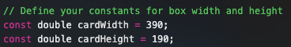
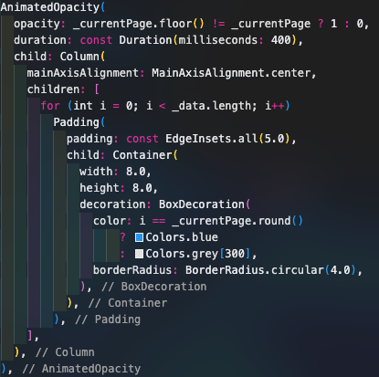

# Smart Stack (iOS Widget Replica) in Flutter

This Flutter component is based on the iOS Smart Stack widget, which allows to display multiple widget in a scrolling stack, doing so, saving space for other UI elements.

Despite it has already been few months since Apple implemented it on iOS, I was desperately looking for a ready-to-use component on the internet, unfortunately I could not find any.

So I decided to create my own widget/component and today, this might change your life, (or day 😆).

##### Support my work  🍺🍕

## Getting Started

The component is indeed in a very primordial state, there is room for improvement, but it definitely works. It also scrolls automatically every 7 seconds.

- Boxes/Cards size can be set through this constants:

- Colors, opacities and animation speeds can be easily changed too:

Scroll and fade animations are still a bit snappy, but I will try to improve it overtime. Eventually, turning it into a customizable and user-friendly component.
