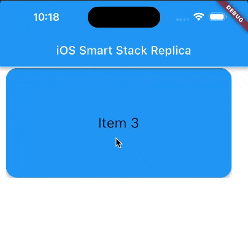
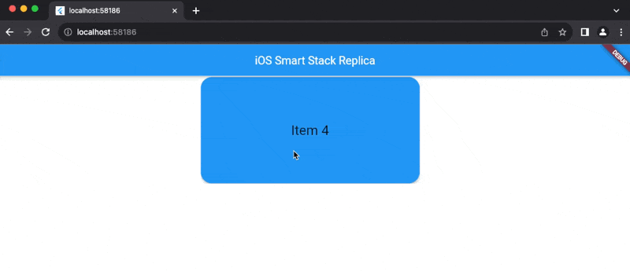
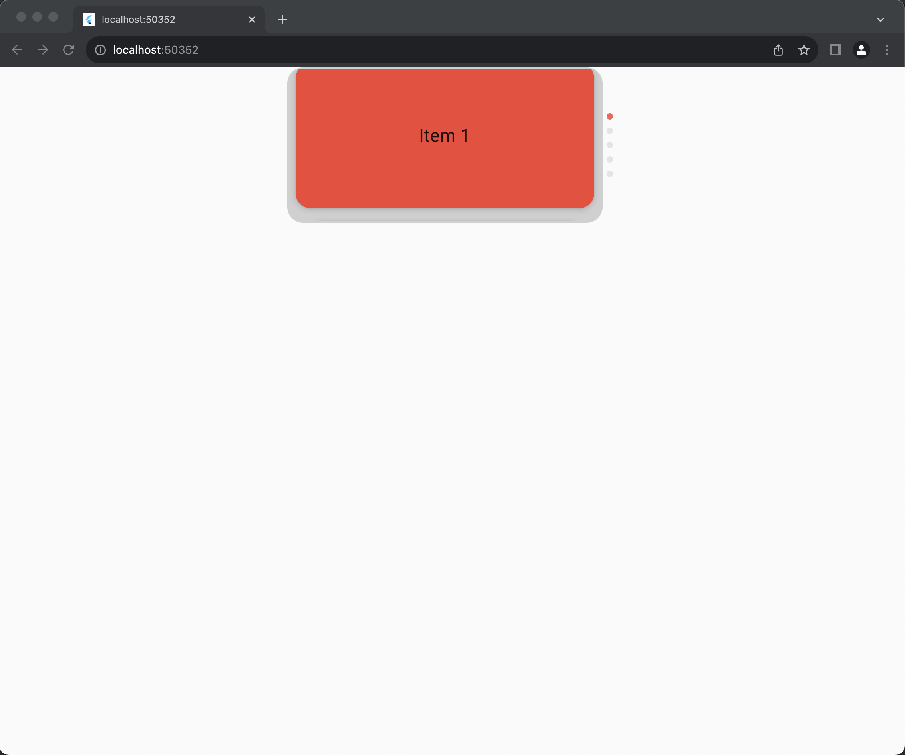

# Smart Stack (iOS Widget Replica) in Flutter

This Flutter component is based on the iOS Smart Stack widget, which allows to display multiple widget in a scrolling stack, doing so, saving space for other UI elements.

Despite it has already been few months since Apple implemented it on iOS, I was desperately looking for a ready-to-use component on the internet, unfortunately I could not find any.

So I decided to create my own widget/component and today, this might change your life, (or day 😆).





##### Support my work  🍺🍕

[](https://paypal.me/MattRaciti?country.x=IT&locale.x=en_US)
[](https://patreon.com/mattracx)
[](https://donate.stripe.com/4gw29Nb3c7SV1CU144)
[](https://github.com/mattracx/mattracx/assets/1215814/471ab59d-e954-4526-974b-e72ad623d7dc)

## Getting Started

The component is indeed in a very primordial state, there is room for improvement, but it definitely works. All platforms are supported as only native components are being used.

- Boxes/Cards size can be set through this constants:


- Colors, opacities and animation speeds can be easily changed:


It also scrolls automatically every 7 seconds, but that can be changed too.

Scroll and fade animations are still a bit snappy, but I will try to improve it overtime.

# Update 1:

The widgets have now been packed into a single user-friendly and reusable component.

#### Usage Example:


```dart
static const List<String> _data = [
    'Item 1',
    'Item 2',
    'Item 3',
    'Item 4',
    'Item 5',
    // Add more items as needed
  ];
```

```dart
SmartStack(
        cardWidth: 390,
        cardHeight: 190,
        cardColor: Colors.red,
        indicatorColor: Colors.red,
        overlayColor: const Color(0x33000000),
        borderRadius: 20.0,
        data: _data,
        itemBuilder: (int index) {
          return Center(
            child: Text(
              _data[index],
              style: const TextStyle(fontSize: 24.0),
            ),
          );
        },
      )
```


